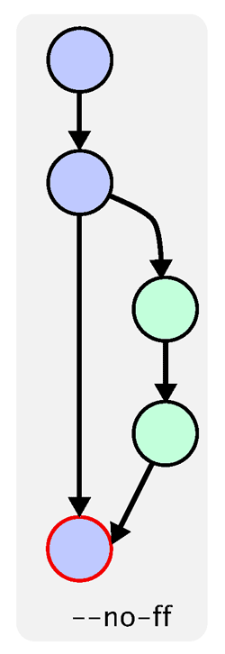

# GitTour


### 一、Git 简介

Git——最流行的分布式版本控制系统。

#### 分布式（Git） VS. 集中式（CVS、 SVN）

CVS 和 SVN属于集中式版本控制系统，集中式版本控制系统最大的毛病就是必须要联网才能工作。

Git 属于分布式版本控制系统。
首先，分布式版本控制系统根本没有“中央服务器”，每个人的电脑上都是一个完整的版本库，这样，你工作的时候，就不需要联网了，因为版本库就在你自己的电脑上。因为每个人电脑上都有一个完整的版本库，所以非常适合多人协作。

和集中式版本控制系统相比，分布式版本控制系统的安全性要高很多，因为每个人电脑里都有完整的版本库，某一个人的电脑坏掉了不要紧，随便从其他人那里复制一个就可以了。

Git 还有一个优势就是极其强大的分支管理。

### 二、Git 的安装
- Linux
- Mac OS
- Windows


### 三、一些概念


#### 1. 工作区和暂存区

- 工作区（Working Directory）：在 git 管理下的普通文件夹都算是工作区，我们平时的编辑工作都是在工作区完成。
- 暂存区（Stage）：临时区域，里面存放将要提交文件的快照。工作区所在的目录下有一个隐藏目录`.git`，这个不算工作区，而是Git的版本库。Git的版本库里存了很多东西，其中最重要的就是称为 stage（或者叫index）的暂存区，还有Git为我们自动创建的第一个分支 master，以及指向master的一个指针叫 `HEAD`。
- 历史记录（History）：保存 git commit 的记录区。


我们把文件往Git版本库里添加的时候，是分两步执行的：
- 第一步是用 `git add` 把文件添加进去，实际上就是把文件修改添加到暂存区；
- 第二步是用 `git commit` 提交更改，实际上就是把暂存区的所有内容提交到当前分支。

因为我们创建 Git 版本库时，Git自动为我们创建了唯一一个 master 分支，所以，现在，git commit就是往master分支上提交更改。

你可以简单理解为，**需要提交的文件修改通通放到暂存区，然后，一次性提交暂存区的所有修改**（没有被添加到暂存区的修改是不会被提交的）。


#### 2. 远程仓库（Remote repositories）

在使用 Git 进行多人协同工作时，一般会有一台电脑充当服务器的角色，每天24小时开机，其他每个人都从这个“服务器”仓库克隆一份到自己的电脑上，并且各自把各自的提交推送到服务器仓库里，也从服务器仓库中拉取别人的提交。

这个“服务器”仓库就是一个远程仓库。

**推荐阅读：**

- [Git Basics - Working with Remotes](https://git-scm.com/book/en/v2/Git-Basics-Working-with-Remotes)

#### 3. SSH key

一般本地 Git 仓库和远程 Git 仓库之间的传输是通过 SSH 加密的，所以需要设置一下 SSH key。

为什么GitHub需要SSH Key呢？因为GitHub需要识别出你推送的提交确实是你推送的，而不是别人冒充的，而Git支持SSH协议，所以，GitHub只要知道了你的公钥，就可以确认只有你自己才能推送。

当然，GitHub允许你添加多个Key。假定你有若干电脑，你一会儿在公司提交，一会儿在家里提交，只要把每台电脑的Key都添加到GitHub，就可以在每台电脑上往GitHub推送了。


#### 4. GitHub


如果你先在本地创建了 Git 仓库，然后又在 GitHub 上创建了一个远程仓库，如何将本地的 Git 仓库跟 GitHub 上的 Git 仓库关联起来？

```
# push an existing repository from the command line

$ git remote add origin git@github.com:ShannonChenCHN/GitTour.git
$ git push -u origin master
```

由于远程库是空的，我们第一次推送master分支时，加上了-u参数，Git不但会把本地的master分支内容推送的远程新的master分支，还会把本地的master分支和远程的master分支关联起来，在以后的推送或者拉取时就可以简化命令。

比如，以后只要本地作了提交，就可以通过命令：

```
$ git push origin master
```
把本地 master 分支的最新修改推送至 GitHub 上的远程仓库了。

### 四、 分支（Branching）

分支特性能够让我们在不影响“主线开发进程”的情况下，去继续做一些其他开发任务，并且在最终可以将结果合并到“主开发进程”上。

Git 的分支功能是一个能够秒杀其他版本控制系统的 feature，其特点在于轻量、即时、快速。很多其他的 VCS 工具也可以实现分支开发，但是都是需要将整个项目代码重新拷贝一份，这样既低效又费时，而且还占用大量空间。

#### 1. 分支的本质

分支的本质实际上是指针的控制，切换和合并分支实际上是调整相关指针的指向。

每次提交，Git 都把它们串成一条时间线，master 分支对应的 master 指针，指向最近的一次提交，而 HEAD 指针指向的是当前分支。

（1）提交：每次提交，当前分支都会向前移动一步，这样，随着你不断提交，当前分支的线也越来越长。

```
            HEAD
              ↓
            master
              ↓
----o----o----o
             
注：圆圈“o”代表一次 commit

```

（2）创建并切换到新分支：执行 `checkout -b dev` 时，Git 新建了一个指针叫 dev，指向 master 相同的提交，再把 HEAD 指向 dev，就表示当前分支在 dev 上。

```
            master
              ↓
----o----o----o
              ↑
             dev
              ↑
            HEAD

```

（3）切换分之后的提交：每新提交一次，dev 指针和 HEAD 指针往前移动一步，而 master 指针不变。

```
            master
              ↓
----o----o----o~~~~●
                   ↑
                  dev
                   ↑
                 HEAD

```
（4）合并分支：把 dev 合并到 master 上，其实就是直接把 master 指向 dev 的当前提交。

```
                master
                   ↓
----o----o----o~~~~●
                   ↑
                  dev
                   ↑
                 HEAD

```

（5）删除分支：删除 dev 分支就是把 dev 指针给删掉，删掉后，我们就剩下了一条 master 分支。

```
                master
                   ↓
----o----o----o~~~~●
```

**推荐阅读：** 
           
- [创建和合并分支 - 廖雪峰的官方网站](https://www.liaoxuefeng.com/wiki/0013739516305929606dd18361248578c67b8067c8c017b000/001375840038939c291467cc7c747b1810aab2fb8863508000)
- [Git Branching - Branches in a Nutshell](https://git-scm.com/book/en/v2/Git-Branching-Branches-in-a-Nutshell)


#### 2. 分支策略

- master：主分支，这个分支应该是非常稳定的，也就是仅用来发布新版本，平时不能在上面开发；
- dev 分支：辅助分支，平时的开发都在dev分支上，也就是说，dev分支是不稳定的，到某个时候，比如1.0版本发布时，再把dev分支合并到master上，在master分支发布1.0版本；
- 个人开发分支：每个人都有自己的分支，时不时地往dev分支上合并就可以了。

#### 3. 分支管理


直接使用 `git merge` 合并分支时，默认情况下，Git 执行“快进式合并”（fast-farward merge），会直接将 master 分支指向 dev 分支。

```
$ git merge dev
Updating f1ed183..717b632
Fast-forward
 README.md | 62 +++++++++++++++++++++++++++++++++++++++++++++++++++++--------
 1 file changed, 54 insertions(+), 8 deletions(-)
```


另一种合并分支的方式是 `git merge --no-ff dev`，使用 `--no-ff` 参数后，会执行正常合并，并在 master 分支上生成一个新节点，也就是生成一个新的 commit，这样从分支历史上就可以看出分支信息（加上 `-m` 参数，可以把 commit 注释同时写上去）。

```
$ git merge --no-ff -m "merge with no-ff" dev
Merge made by the 'recursive' strategy.
 README.md | 14 ++++++++++++++
 1 file changed, 14 insertions(+)
```




**小结：**

合并分支时，加上 `--no-ff` 参数就可以用 recursive 模式合并，合并后的历史有分支，能看出来曾经做过合并，而 fast forward 合并就看不出来曾经做过合并（可以借助 `git log --graph` 命令）。

<div style="width: 50%; margin: 0 auto;">Hello</div>
<div align="center"></div>
<p><center>合并前</center></p>
 
<div align="center"></div>
<p><center>使用 git merge 合并</center></p>


<div align="center"></div>
<p><center>使用 git merge --no-off 合并</center></p>

**推荐阅读：**

- [Git分支管理策略](http://www.ruanyifeng.com/blog/2012/07/git.html)
- [Understanding the Git Workflow](https://sandofsky.com/blog/git-workflow.html)


### 五、解决冲突

当因为两个不同分支修改了相同文件而导致 Git 无法自动合并分支时，就必须首先解决冲突。解决冲突后，再提交，合并完成。

解决冲突就是把 Git 合并失败的文件手动编辑为我们希望的内容，再提交。Git 会用 `<<<<<<<`，`=======`，`>>>>>>>` 标记出不同分支的内容。


```
                    HEAD
                     ↓
                   master
                     ↓
----o----o----o--o---●
               \    /
                \  / 
                 o
                 ↑
              feature_01

```

### 六、储藏和清理（git stash）

有时，当你在项目的一部分上已经工作一段时间后，所有东西都进入了混乱的状态，而这时你想要切换到另一个分支做一点别的事情。 问题是，你不想仅仅因为过会儿回到这一点而为做了一半的工作创建一次提交。 这个时候 git stash 就派上用场了。

储藏会处理工作目录的脏的状态，也就是修改的跟踪文件与暂存改动，然后将未完成的修改保存到一个栈上，而你可以在任何时候重新应用这些改动。

#### 6.1 储藏工作

在改动文件后，执行 `git stash` 即可 stash 修改的内容（包括已经被添加到暂存区的修改内容）：

```
$ git stash 
```

查看 stash 列表：

```
$ git stash list
```

#### 6.2 应用储藏
一是用 git stash apply 恢复，但是恢复后，stash 内容并不删除，你需要用 git stash drop 来删除:

```
$ git stash apply stash@{0}
$ git stash drop stash@{0}
```

另一种方式是用 git stash pop，恢复的同时把 stash 内容也删了：

```
$ git stash pop stash@{0}
```


**参考**

- [Git 工具 - 储藏与清理](https://git-scm.com/book/zh/v2/Git-%E5%B7%A5%E5%85%B7-%E5%82%A8%E8%97%8F%E4%B8%8E%E6%B8%85%E7%90%86)

### 七、常用命令

#### 1. 基本
- `git init`，初始化一个Git仓库
- `git add <file>`，添加文件修改内容到暂存区
- `git stage <file>`，git add 的同义命令
- `git rm <file>`，删除文件后，将修改内容同步到暂存区，用 git add 也可实现同样的效果
- `git commit [-m <msg>]`，把修改后的内容提交到仓库
- `git status`，工作区当前的状态
- `git diff`，查看修改内容
- `git log`，查看 commit 历史记录，以便确定要回退到哪个版本
- `git reflog`，查看 HEAD  修改的历史记录，可以用来切换到以前的某次 commit 版本


#### 2. 撤销
- `git checkout -- <file>`，可以丢弃工作区的修改，也就是撤销 `git add` 的操作
- `git reset HEAD <file>`，把暂存区的修改撤销掉（unstage），重新放回工作区，也就是撤销`git commit` 的操作
- `git reset --hard <commit>`，切换到某个指定的 commit 版本（HEAD 指向的版本就是当前版本，当然，严格来讲，HEAD 是指向的不是提交而是当前分支）

#### 3. 分支
- `git branch`，查看当前分支
- `git branch <banch-name>`，创建新分支
- `git checkout <branch-name>`，切换分支
- `git checkout -b <branch-name>`，创建+切换分支
- `git merge <branch-name>`，合并分支到当前分支
- `git merge --on-ff <branch-name>`，合并分支到当前分支，同时创建一个新的 commit
- `git branch -d <branch-name>`，删除分支
- `git log --graph`，查看分支合并图
- `git log --graph --pretty=oneline --abbrev-commit`，查看简洁形式的分支合并图

#### 4. 其他
- `git stash`，储藏
- `git stash list`，查看储藏列表
- `git stash apply [<stash>]`，取出储藏的记录，如果不指定一个储藏，Git 认为指定的是最近的储藏
- `git stash pop [<stash>]`，跟 apply 作用相同，但是会在应用储藏后将其移除
- `git stash drop`：移除储藏


### 参考
- [廖雪峰的官方网站](https://www.liaoxuefeng.com/wiki/0013739516305929606dd18361248578c67b8067c8c017b000)
- [Pro Git](https://git-scm.com/book/zh/v2)
