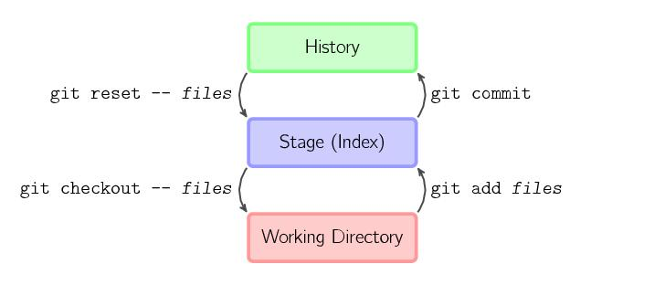

# GitTour

### Git 简介

Git——最流行的分布式版本控制系统。

### 分布式（Git） VS. 集中式（CVS、 SVN）

CVS 和 SVN属于集中式版本控制系统，集中式版本控制系统最大的毛病就是必须要联网才能工作。

Git 属于分布式版本控制系统。
首先，分布式版本控制系统根本没有“中央服务器”，每个人的电脑上都是一个完整的版本库，这样，你工作的时候，就不需要联网了，因为版本库就在你自己的电脑上。因为每个人电脑上都有一个完整的版本库，所以非常适合多人协作。

和集中式版本控制系统相比，分布式版本控制系统的安全性要高很多，因为每个人电脑里都有完整的版本库，某一个人的电脑坏掉了不要紧，随便从其他人那里复制一个就可以了。

Git 还有一个优势就是极其强大的分支管理。

### Git 的安装
- Linux
- Mac OS
- Windows

### 一些概念

#### 工作区和暂存区

- 工作区（Working Directory）：在 git 管理下的普通文件夹都算是工作区，我们平时的编辑工作都是在工作区完成。
- 暂存区（Stage）：临时区域，里面存放将要提交文件的快照。工作区所在的目录下有一个隐藏目录`.git`，这个不算工作区，而是Git的版本库。Git的版本库里存了很多东西，其中最重要的就是称为 stage（或者叫index）的暂存区，还有Git为我们自动创建的第一个分支 master，以及指向master的一个指针叫 `HEAD`。
- 历史记录（History）：保存 git commit 的记录区。

我们把文件往Git版本库里添加的时候，是分两步执行的：
- 第一步是用 `git add` 把文件添加进去，实际上就是把文件修改添加到暂存区；
- 第二步是用 `git commit` 提交更改，实际上就是把暂存区的所有内容提交到当前分支。

因为我们创建 Git 版本库时，Git自动为我们创建了唯一一个 master 分支，所以，现在，git commit就是往master分支上提交更改。

你可以简单理解为，**需要提交的文件修改通通放到暂存区，然后，一次性提交暂存区的所有修改**（没有被添加到暂存区的修改是不会被提交的）。

#### 远程仓库

在使用 Git 进行多人协同工作时，一般会有一台电脑充当服务器的角色，每天24小时开机，其他每个人都从这个“服务器”仓库克隆一份到自己的电脑上，并且各自把各自的提交推送到服务器仓库里，也从服务器仓库中拉取别人的提交。

这个“服务器”仓库就是一个远程仓库。

#### SSH key

一般本地 Git 仓库和远程 Git 仓库之间的传输是通过 SSH 加密的，所以需要设置一下 SSH key。

为什么GitHub需要SSH Key呢？因为GitHub需要识别出你推送的提交确实是你推送的，而不是别人冒充的，而Git支持SSH协议，所以，GitHub只要知道了你的公钥，就可以确认只有你自己才能推送。

当然，GitHub允许你添加多个Key。假定你有若干电脑，你一会儿在公司提交，一会儿在家里提交，只要把每台电脑的Key都添加到GitHub，就可以在每台电脑上往GitHub推送了。

### 命令

- git init，初始化一个Git仓库
- git add <file>，添加文件修改内容到暂存区
- git stage <file>，git add 的同义命令
- git rm <file>，删除文件后，将修改内容同步到暂存区，用 git add 也可实现同样的效果
- git commit [-m <msg>]，把修改后的内容提交到仓库
- git status，工作区当前的状态
- git diff，查看修改内容
- git reset --hard <commit>，切换到某个指定的 commit 版本（HEAD 指向的版本就是当前版本）
- git log，查看 commit 历史记录，以便确定要回退到哪个版本
- git reflog，查看 HEAD  修改的历史记录，可以用来切换到以前的某次 commit 版本

### 参考
- [廖雪峰的官方网站](https://www.liaoxuefeng.com/wiki/0013739516305929606dd18361248578c67b8067c8c017b000)
- [Pro Git](https://git-scm.com/book/zh/v2)
